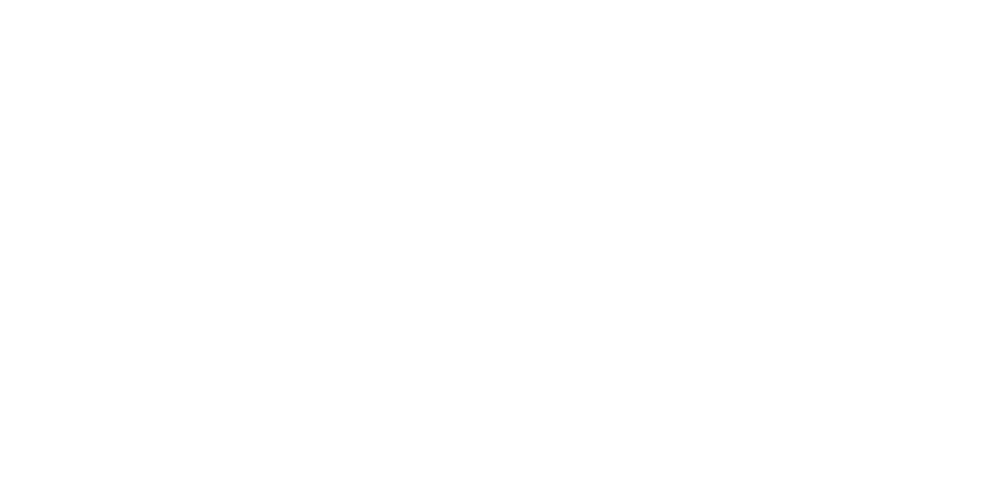

# 📚 Notezy - AI-Powered Educational Platform

An intelligent educational platform that transforms YouTube videos and PDF documents into interactive learning materials using advanced AI technology.



## 🌟 Overview

Notezy is a comprehensive full-stack educational platform that leverages AI to revolutionize the learning experience. It converts educational content from YouTube videos and PDF documents into structured notes, interactive questions, and assessments, making learning more engaging and effective.

## ✨ Key Features

### 🎥 **YouTube Integration**
- Extract and transcribe educational videos using YouTube Transcript API
- AI-powered content analysis and summarization
- Automatic note generation from video content

### 📄 **PDF Processing**
- Upload and process PDF documents
- Extract text and create structured learning materials
- Convert documents into interactive study materials

### 📝 **Smart Note Taking**
- AI-generated notes from video and document content
- Organized and structured note management
- Save and retrieve notes for future reference

### ❓ **Interactive Questions**
- Auto-generate questions from content using Google Gemini AI
- Multiple question types and difficulty levels
- Smart question categorization

### 🧠 **Intelligent Testing**
- Create custom tests from processed content
- Multiple-choice questions with smart scoring
- Performance tracking and analytics

### 👤 **User Management**
- Secure JWT-based authentication
- User registration and login system
- Personalized dashboard and activity tracking

### 📊 **Analytics Dashboard**
- Track learning progress and statistics
- Recent activity monitoring
- Performance insights and metrics

## 🏗️ Technology Stack

### Frontend
- **React 19.1.1** - Modern UI library with latest features
- **TypeScript** - Type-safe development
- **Vite** - Fast build tool and development server
- **TailwindCSS 4.1.13** - Utility-first CSS framework
- **React Router 6.31.0** - Client-side routing
- **Axios 1.7.9** - HTTP client for API calls
- **React Markdown 9.0.2** - Markdown rendering

### Backend
- **Flask 3.1.2** - Python web framework
- **MongoDB** - NoSQL database for data storage
- **Google Gemini AI 1.33.0** - Advanced AI for content generation
- **YouTube Transcript API 1.2.2** - Video transcription
- **PyPDF2 3.0.1** - PDF processing
- **JWT Authentication** - Secure user sessions
- **CORS Support** - Cross-origin resource sharing

### Development Tools
- **ESLint** - Code linting and quality
- **TypeScript Compiler** - Type checking
- **Modern ES6+** - Latest JavaScript features

## 🚀 Quick Start

### Prerequisites
- **Node.js** (v18 or higher)
- **Python** (v3.8 or higher)
- **MongoDB** (local or cloud instance)
- **Google AI API Key** (for Gemini AI)

### 1. Clone the Repository
```bash
git clone https://github.com/your-username/notezy-hackodhisha.git
cd notezy-hackodhisha
```

### 2. Frontend Setup
```bash
cd client
npm install
npm run dev
```

### 3. Backend Setup
```bash
cd server

# Create virtual environment
python -m venv env

# Activate virtual environment
# Windows:
env\Scripts\activate
# macOS/Linux:
source env/bin/activate

# Install dependencies
pip install -r requirements.txt

# Run the server
python app.py
```

### 4. Environment Configuration
Create a `.env` file in the server directory:
```env
MONGODB_URI=your_mongodb_connection_string
GOOGLE_API_KEY=your_google_ai_api_key
JWT_SECRET_KEY=your_jwt_secret_key
FLASK_ENV=development
```

## 📱 Usage Guide

### Getting Started
1. **Register/Login**: Create an account or sign in to access the platform
2. **Dashboard**: View your learning statistics and recent activity
3. **Learn**: Upload PDFs or paste YouTube URLs to generate content

### Processing Content
1. **YouTube Videos**:
   - Copy any educational YouTube video URL
   - Paste it in the Learn section
   - AI will transcribe and generate notes automatically

2. **PDF Documents**:
   - Upload any educational PDF file
   - System will extract text and create structured notes
   - Generate questions and tests from the content

### Study Materials
- **Notes**: Access all generated notes in the Notes section
- **Questions**: Review AI-generated questions for better understanding
- **Tests**: Take interactive tests to assess your knowledge

## 🏛️ Project Structure

```
notezy-hackodhisha/
├── client/                          # React Frontend
│   ├── public/                      # Static assets
│   │   ├── images/                  # Application images
│   │   └── vite.svg                 # Vite logo
│   ├── src/                         # Source code
│   │   ├── components/              # React components
│   │   │   ├── elements/            # UI elements
│   │   │   └── layout/              # Layout components
│   │   ├── pages/                   # Application pages
│   │   ├── context/                 # React context
│   │   ├── config/                  # Configuration files
│   │   └── assets/                  # Frontend assets
│   ├── package.json                 # Frontend dependencies
│   └── vite.config.ts              # Vite configuration
├── server/                          # Flask Backend
│   ├── controllers/                 # API controllers
│   │   ├── auth_controllers.py      # Authentication logic
│   │   ├── notes_controllers.py     # Notes management
│   │   ├── questions_controller.py  # Questions handling
│   │   ├── tests_controller.py      # Tests management
│   │   ├── transcription_controller.py # YouTube processing
│   │   └── pdf_controller.py        # PDF processing
│   ├── decorators/                  # Custom decorators
│   ├── genai/                       # AI integration
│   ├── pdf_handling/                # PDF utilities
│   ├── youtube/                     # YouTube utilities
│   ├── config/                      # Server configuration
│   ├── app.py                       # Main application
│   └── requirements.txt             # Python dependencies
└── README.md                        # Project documentation
```

## 🔧 API Endpoints

### Authentication
- `POST /register` - User registration
- `POST /login` - User login
- `GET /profile` - Get user profile (protected)

### Content Processing
- `POST /transcribe` - Process YouTube URL
- `POST /upload-pdf` - Upload and process PDF
- `GET /notes` - Retrieve user notes
- `POST /notes` - Create new note

### Educational Content
- `GET /questions` - Get generated questions
- `POST /questions` - Create questions from content
- `GET /tests` - Retrieve tests
- `POST /tests` - Generate new test
- `POST /submit-test` - Submit test answers

## 🔐 Security Features

- **JWT Authentication**: Secure token-based authentication
- **Password Hashing**: Secure password storage
- **Input Validation**: Comprehensive input sanitization
- **CORS Protection**: Controlled cross-origin requests
- **API Rate Limiting**: Prevention of abuse

## 🚀 Deployment

### Frontend Deployment (Vercel/Netlify)
```bash
cd client
npm run build
# Deploy the dist/ directory
```

### Backend Deployment (Heroku/Railway)
```bash
cd server
# Ensure requirements.txt is updated
pip freeze > requirements.txt
# Deploy using your preferred platform
```

### Environment Variables for Production
```env
MONGODB_URI=mongodb://your-production-db
GOOGLE_API_KEY=your-production-api-key
JWT_SECRET_KEY=your-strong-secret-key
FLASK_ENV=production
```

## 🤝 Contributing

We welcome contributions! Please follow these steps:

1. **Fork** the repository
2. **Create** a feature branch (`git checkout -b feature/amazing-feature`)
3. **Commit** your changes (`git commit -m 'Add amazing feature'`)
4. **Push** to the branch (`git push origin feature/amazing-feature`)
5. **Open** a Pull Request

### Development Guidelines
- Follow TypeScript/Python coding standards
- Write descriptive commit messages
- Add tests for new features
- Update documentation as needed

## 📋 Requirements

### System Requirements
- **Node.js**: 18.0.0 or higher
- **Python**: 3.8.0 or higher
- **MongoDB**: 4.4 or higher
- **Memory**: 2GB RAM minimum
- **Storage**: 1GB free space

### Browser Support
- Chrome 90+
- Firefox 88+
- Safari 14+
- Edge 90+

## 🐛 Troubleshooting

### Common Issues

1. **YouTube Processing Errors**
   - Ensure video has available transcripts
   - Check your internet connection
   - Verify YouTube URL format

2. **PDF Upload Issues**
   - Maximum file size: 10MB
   - Supported formats: PDF only
   - Ensure PDF is not password-protected

3. **AI Generation Failures**
   - Check Google AI API key validity
   - Verify API quota limits
   - Ensure content is in supported language

4. **Database Connection**
   - Verify MongoDB connection string
   - Check database permissions
   - Ensure network connectivity

## 📄 License

This project is licensed under the MIT License - see the [LICENSE](LICENSE) file for details.

## 👥 Team

- **Lead Developer**: [Your Name] - Full-stack development and AI integration
- **UI/UX Designer**: [Team Member] - User interface and experience design

## 🙏 Acknowledgments

- **Google Gemini AI** for advanced content generation
- **YouTube Transcript API** for video transcription
- **React Community** for excellent documentation
- **Flask Community** for robust backend framework

## 📞 Support

For support and questions:
- **Email**: support@notezy.com
- **GitHub Issues**: [Create an Issue](https://github.com/your-username/notezy-hackodhisha/issues)
- **Documentation**: [Wiki](https://github.com/your-username/notezy-hackodhisha/wiki)

---

**Made with ❤️ for HackOdisha 2024**

Transform your learning experience with AI-powered education tools!
